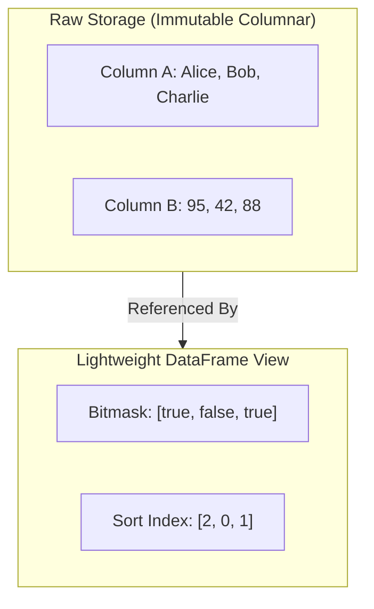

# 🎋 Bamboo

> **Bamboo** — because Pandas eat Bamboo. 🐼
>
> A lightning-fast, zero-dependency, 100% type-safe DataFrame library for TypeScript and JavaScript. Built for speed, developer joy, and memory efficiency.

[](https://bun.sh)
[](https://www.typescriptlang.org/)
[](https://opensource.org/licenses/MIT)

---

Bamboo brings Python's **Pandas**-style data wrangling to the JS/TS ecosystem—without the clunkiness, without the massive bundle sizes, and with **uncompromising type-safety**. 

Every filter, join, derivation, select, and aggregation automatically propagates its types, giving you full IDE autocomplete and compile-time correctness from raw ingestion to final report.

---

## ✨ Features at a Glance

- 🛡️ **Full Type Inset & Autocomplete**: Advanced TypeScript generics track your schema across every step of your query pipeline. No more `any` casting or guessing column names.
- ⚡ **Zero-Copy & Lazy Engine**: Operations like `.filter()` and `.sort()` do not duplicate large column arrays. They manipulate lightweight, bitmasked indices internally and only materialize rows on-demand.
- 🧩 **No External Dependencies**: Extremely lightweight. Perfect for edge functions, serverless backends, browsers, and CLI tools.
- 🔬 **Expressive API**: Chainable methods for row-slicing (`head`, `tail`), column operations (`select`, `drop`, `rename`, `derive`, `fillNull`), joins, concats, and group-by aggregations.
- 🚀 **Built for Modern Runtimes**: Developed and optimized with [Bun](https://bun.sh) but compatible with Node.js, Deno, and modern browsers (compiles to ESM & CJS).

---

## 🚀 Quick Start

### 1. Installation
Install Bamboo using your favorite package manager:

```bash
# Using npm
npm install bamboo

# Using Bun
bun add bamboo

# Using pnpm
pnpm add bamboo

# Using yarn
yarn add bamboo
```

### 2. A Simple, Elegant Pipeline

Here is how you can build a complete, type-safe e-commerce analysis pipeline in under 30 lines of code:

```typescript
import { fromRows, sum, count } from "bamboo";

// 1. Load your dataset with typed rows
const products = fromRows([
  { productId: "p1", name: "Wireless Mouse", price: 29.99 },
  { productId: "p2", name: "Mechanical Keyboard", price: 89.99 },
]);

const orders = fromRows([
  { orderId: "o1", productId: "p1", qty: 2, discount: 10 }, // 10% off
  { orderId: "o2", productId: "p2", qty: 1, discount: null }, // no discount
]);

// 2. Run a chain of transformations with 100% IDE autocomplete
const salesReport = orders
  // Standardize null values gracefully
  .fillNull({ discount: 0 })
  // Perform an inner join on the common key "productId"
  .join(products, { on: "productId", how: "inner" })
  // Derive custom columns with type-safe operations
  .derive({
    revenue: (row) => row.qty * row.price * (1 - (row.discount as number) / 100),
  })
  // Group by product name and aggregate results
  .groupBy("name")
  .aggregate({
    totalRevenue: sum("revenue"),
    unitsSold: sum("qty"),
    orderCount: count(),
  })
  // Sort results descending
  .sort([{ col: "totalRevenue", dir: "desc" }]);

// 3. Output results
console.log(salesReport.toRows());
/*
Output:
[
  { name: "Mechanical Keyboard", totalRevenue: 89.99, unitsSold: 1, orderCount: 1 },
  { name: "Wireless Mouse",      totalRevenue: 53.98, unitsSold: 2, orderCount: 1 }
]
*/
```

---

## 🛡️ Uncompromised TypeScript Support

Most JavaScript DataFrame libraries make you cast everything to `any` or strings. Bamboo is designed from the ground up to keep TypeScript happy. 

Watch how your schema types flow dynamically:

```typescript
const df = fromRows([{ id: 1, name: "Alice", score: 95 }]);
// Inferred Type: DataFrame<{ id: number; name: string; score: number }>

const subset = df.select(["name", "score"]);
// Inferred Type: DataFrame<{ name: string; score: number }>

const renamed = subset.rename({ score: "finalGrade" });
// Inferred Type: DataFrame<{ name: string; finalGrade: number }>

const derived = renamed.derive({ passed: (r) => r.finalGrade >= 50 });
// Inferred Type: DataFrame<{ name: string; finalGrade: number; passed: boolean }>
```
Your editor will prevent you from sorting by non-existent columns, aggregating non-numeric fields, or accessing properties that have been dropped.

---

## ⚡ Under the Hood: Zero-Copy Lazy Engine

Unlike traditional libraries that clone entire datasets whenever you filter or sort, Bamboo's columnar architecture separates data storage from the active view.



1. **Columnar Storage**: Data is stored vertically in contiguous arrays per column rather than horizontally in objects. This improves CPU cache friendliness and memory efficiency.
2. **Lightweight Bitmasking**: Calling `.filter()` simply updates a boolean bitmask array. It **does not copy** or recreate the underlying data.
3. **Sort Indexing**: Calling `.sort()` generates a lightweight array of pointers/indices reflecting the sorted order, leaving the raw column arrays untouched.
4. **On-Demand Materialization**: The raw row objects are only fully constructed ("materialized") when you explicitly request them using `.toRows()`, `.toCSV()`, or `.toJSON()`.

This makes Bamboo highly performant and incredibly gentle on memory.

---

## 🛠️ API Reference

Bamboo is packed with all the primitives you need for professional data engineering:

| Category | Method | Description |
|---|---|---|
| **Ingestion** | `fromRows(rows)` | Creates a DataFrame from an array of JS objects. |
| | `fromCSV(csvText)` | Parses a CSV string into a DataFrame. |
| **Output** | `.toRows()` | Materializes the current view back into an array of objects. |
| | `.toColumns()` | Returns an object containing column-wise data arrays. |
| | `.toCSV()` / `.toJSON()` | Serializes the current DataFrame view. |
| **Selection** | `.select(cols)` | Keeps only the specified columns. |
| | `.drop(cols)` | Excludes specified columns, keeping the rest. |
| | `.rename(mapping)` | Renames columns with compile-time mapping. |
| **Transformation**| `.derive(fns)` | Appends or overwrites columns using custom window/row functions. |
| | `.fillNull(defaults)` | Fills null or undefined values with static defaults. |
| **Filtering** | `.filter(fn)` | Keeps only rows that satisfy the predicate function. |
| | `.dropNull(cols?)` | Discards rows containing null values (globally or in specific columns). |
| | `.distinct(cols?)` | Retains unique rows based on specified key columns. |
| **Wrangling** | `.sort(by)` | Stable sort of rows across multiple columns (supports `asc` / `desc`). |
| | `.groupBy(keys)` | Returns a GroupedFrame for split-apply-combine aggregates. |
| | `.join(other, opts)` | SQL-like relational joins (`inner`, `left`, `right`, `outer`). |
| | `.concat(...others)` | Stacks multiple DataFrames vertically. |

---

## 📂 Explore the Examples

Check out the `/examples` folder to see Bamboo tackle real-world datasets:
- 📊 `gapminder.ts`: Analyzing historical world population, GDP, and life expectancy.
- 🛒 `ecommerce.ts`: Processing orders, computing category sales trends, and generating JSON summaries.
- 🌦️ `weather.ts`: Computing weekly temperature rolling averages and finding national climate extremes using window functions.

To run any example (using Bun):
```bash
bun examples/gapminder.ts
```

Or using Node.js (v22.6+):
```bash
node --experimental-strip-types examples/gapminder.ts
```

---

## 🧪 Development

Contributions, bug reports, and feature requests are very welcome!

To get started with development:
```bash
# Clone the repository
git clone https://github.com/your-username/bamboo.git
cd bamboo

# Install dependencies
bun install

# Run the test suite (130+ unit tests)
bun test

# Build production bundle (ESM + CommonJS)
bun run build
```

---

## 📄 License

Bamboo is released under the [MIT License](LICENSE). Feel free to use it in any personal or commercial project!
